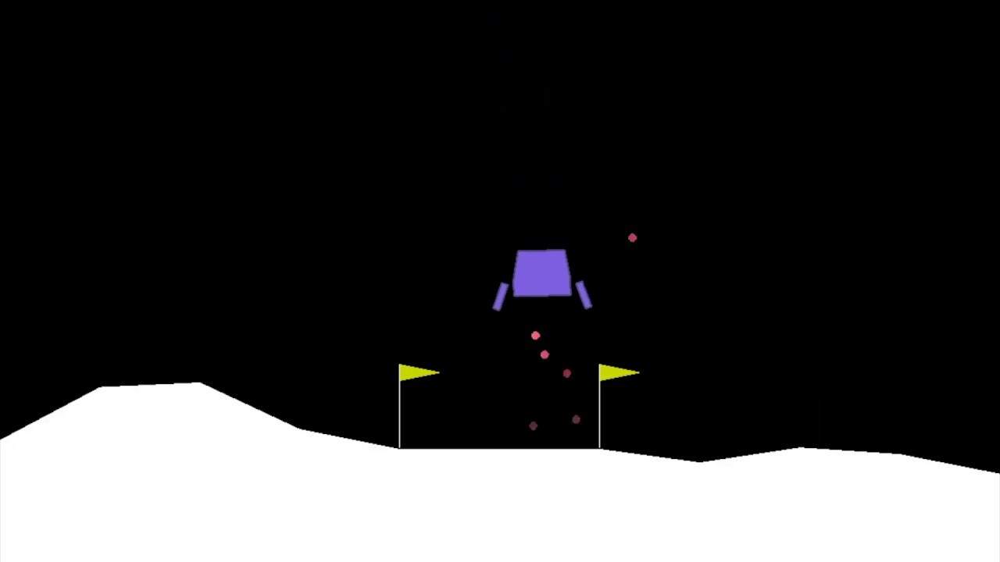

# Applying Deep Reinforcement Learning to _Lunar Lander_
This repository was first created during a research internship I attended at the Professorship of Bioinformatics
at Technical University Munich as a part of my B.Sc. Chemical Biotechnology degree.
Initially, it was meant to track the internship's progress and for me to learn the basics of git and GitHub. 
Since then, I keep updating this to polish my abilities in other areas, such as DevOps or MLOps with MLFlow.



---
# Project Structure
## Branches
- `main` contains all the code I have written until the end of my internship with additional fixes of code-breaking 
pieces of code.
- `updates` is a refactor. The goal is to showcase my improvement in both programming capabilities, git 
knowledge, etc.

## The Repository
If the agent achieves the required average score of at least 200.0 within the last 100 training episodes, the
parameters of both the local and the target networks are saved to a Unique Resource Identifier (URI)
as `qnet_local` and `qnet_target`. These can be later imported via MLflow's Pytorch submodule.

## Setup
Install the required dependencies via:
```bash
conda install --name <ENV-NAME:STR> --file environment.yaml
```

> [!NOTE]
> Installing `torch` wheels via `pip` may introduce a mismatch of dependencies between the modules and cause an OpenMP
> error, preventing automatic figure logging.

To see your runs in the browser, enable a local MLFlow server via a given port.
```bash
mlflow server --port <INT>
```
You can view your experiments and runs in them via MLflow GUI by opening [localhost](http://localhost:5000/) in your browser.
This is not necessary to log if you provide a localhost as the default Uniform Resource Identifier (URI).
